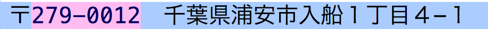
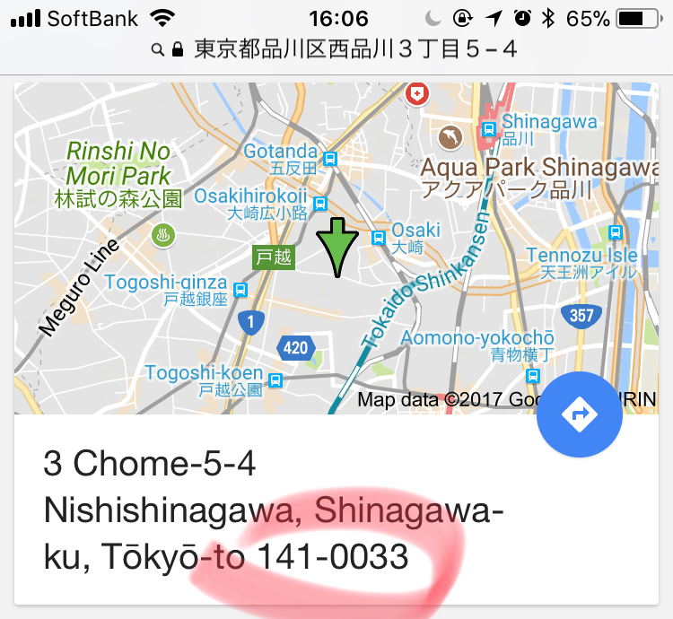

# Keras sequence to sequence example
Very simple Keras implementation of a sequence to sequence model with several examples.

[](https://github.com/philipperemy/keras-seq2seq-example/blob/master/LICENSE) [](https://www.tensorflow.org/) [](https://keras.io/) 

<p align="center">
  
  <br><i>Encoder Decoder model (seq2seq)</i>
</p>


# Japanese postal Addresses ⇄ ZIP Code (seq2seq)

## Problem explained

Based on a Japanese postal address, predict the corresponding ZIP Code.

This address `福島県会津若松市栄町２−４` corresponds to `965-0871`.

The current data set (~300k samples) is composed of postal addresses, scraped from the Japanese yellow pages [itp.ne.jp](itp.ne.jp). One line looks like this:

<p align="center">
  
  <br><i>Row of the data set</i>
</p>

We extract the left part (target) and the right part (inputs) and we build a supervised learning problem.

We expect the accuracy to be very very high because finding the zip code based on the address is a deterministic function (cf. [Zip codes in Japan](http://www.zipcode-jp.com/modules/zipcode/getarea.php?aid=13113)).

Let's also mention that Google contains a big database and lookups are possible. It should give a nearly perfect accuracy.

*The question is: Why do we bother building this model?*

- For the sake of learning!

- Google does not deal with unseen addresses (permute numbers and see if Google knows about it).
- If one or more characters are missing, Google hardly handles it. Deep learning can still make a prediction. 
- We can add noise in the addresses (such as Dropout or character replacement) and train a model on this augmented data set.
- Also it works totally offline (nowadays, it's less important though!)

<p align="center">
  
  <br><i>Screenshot of Google.</i>
</p>

## Training

What you need before executing the scripts

- Keras and tensorflow installed
- One NVIDIA GPU (>GTX1070)
- A lot of RAM (>32GB). The vectorization is highly unoptimized.

```
git clone https://github.com/philipperemy/keras-seq2seq-example.git
cd keras-seq2seq-example
rm -rf *.npz *.pkl nohup.out
python3 utils.py # build the vocabulary and the characters.
python3 vectorization.py
export CUDA_VISIBLE_DEVICES=0; nohup python3 -u model.py &
```

## Results

After a while, you should see an accuracy very close to 1.0 for both the training and the validation set.

This is what I have after the first 10 epochs:

```
Iteration 1
Train on 382617 samples, validate on 42513 samples
Epoch 1/10
382617/382617 [==============================] - 216s - loss: 0.8973 - acc: 0.6880 - val_loss: 0.3011 - val_acc: 0.8997
Epoch 2/10
382617/382617 [==============================] - 197s - loss: 0.1868 - acc: 0.9401 - val_loss: 0.1296 - val_acc: 0.9589
Epoch 3/10
382617/382617 [==============================] - 196s - loss: 0.0921 - acc: 0.9718 - val_loss: 0.0790 - val_acc: 0.9763
Epoch 4/10
382617/382617 [==============================] - 200s - loss: 0.0586 - acc: 0.9825 - val_loss: 0.0562 - val_acc: 0.9839
Epoch 5/10
382617/382617 [==============================] - 201s - loss: 0.0440 - acc: 0.9871 - val_loss: 0.0535 - val_acc: 0.9848
Epoch 6/10
382617/382617 [==============================] - 197s - loss: 0.0345 - acc: 0.9900 - val_loss: 0.0334 - val_acc: 0.9908
Epoch 7/10
382617/382617 [==============================] - 198s - loss: 0.0279 - acc: 0.9920 - val_loss: 0.0305 - val_acc: 0.9918
Epoch 8/10
382617/382617 [==============================] - 196s - loss: 0.0239 - acc: 0.9932 - val_loss: 0.0234 - val_acc: 0.9938
Epoch 9/10
382617/382617 [==============================] - 199s - loss: 0.0207 - acc: 0.9942 - val_loss: 0.0253 - val_acc: 0.9935
Epoch 10/10
382617/382617 [==============================] - 200s - loss: 0.0180 - acc: 0.9950 - val_loss: 0.0263 - val_acc: 0.9933
```

> You might have to run it a second time if it gets blocked around an accuracy of 0.38 after the first epoch. I ran it several times and the accuracy on the testing set was always around 0.90 after the 1st epoch.

After 75 epochs, the accuracy is around 0.9984. So roughly 16 mistakes per 10,000 calls. Not too bad. And the loss is still decreasing!

After 199 epochs, the accuracy is around 0.9986. So roughly 14 mistakes per 10,000 calls. Almost flawless.

The script evaluates some examples once in a while. You can check the training procedure this way. `-` means pad. All the addresses are padded up to the length of the longest address in the dataset.

```
Q -------------------福島県会津若松市栄町２−４
T 965-0871
☑ 965-0871
---
Q -----------------東京都品川区西品川３丁目５−４
T 141-0033
☑ 141-0033
---
Q -------------------滋賀県愛知郡愛荘町市１５７
T 529-1313
☑ 529-1313
---
Q ----------------青森県つがる市木造赤根１３−４０
T 038-3142
☑ 038-3142
---
Q ---------------大阪府東大阪市中鴻池町１丁目６−６
T 578-0975
☑ 578-0975
---
Q ------------------東京都千代田区一番町２７−４
T 102-0082
☑ 102-0082
---
Q ------------神奈川県横須賀市太田和４丁目２５５０−１
T 238-0311
☑ 238-0311
---
Q ------------鹿児島県南さつま市笠沙町片浦２３４７−６
T 897-1301
☑ 897-1301
---
Q ---------------千葉県東金市田間１１５−１−１０２
T 283-0005
☑ 283-0005
---
Q ---------------千葉県匝瑳市八日市場イ２４０４−１
T 289-2144
☑ 289-2144
```

## References

- [https://github.com/fchollet/keras/blob/master/examples/addition_rnn.py](https://github.com/fchollet/keras/blob/master/examples/addition_rnn.py)
- [https://www.tensorflow.org/tutorials/seq2seq](https://www.tensorflow.org/tutorials/seq2seq)
